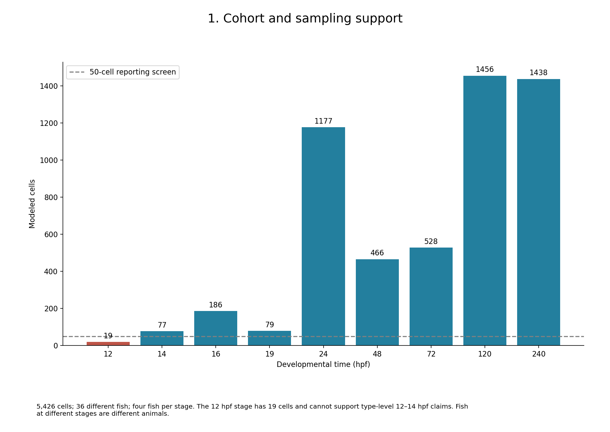
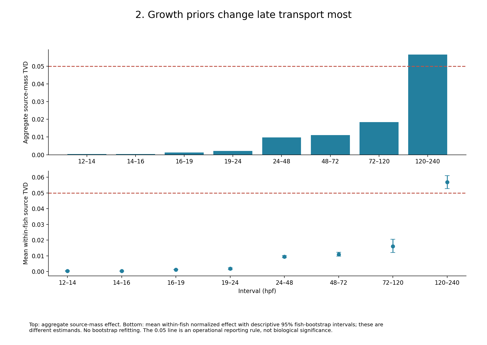
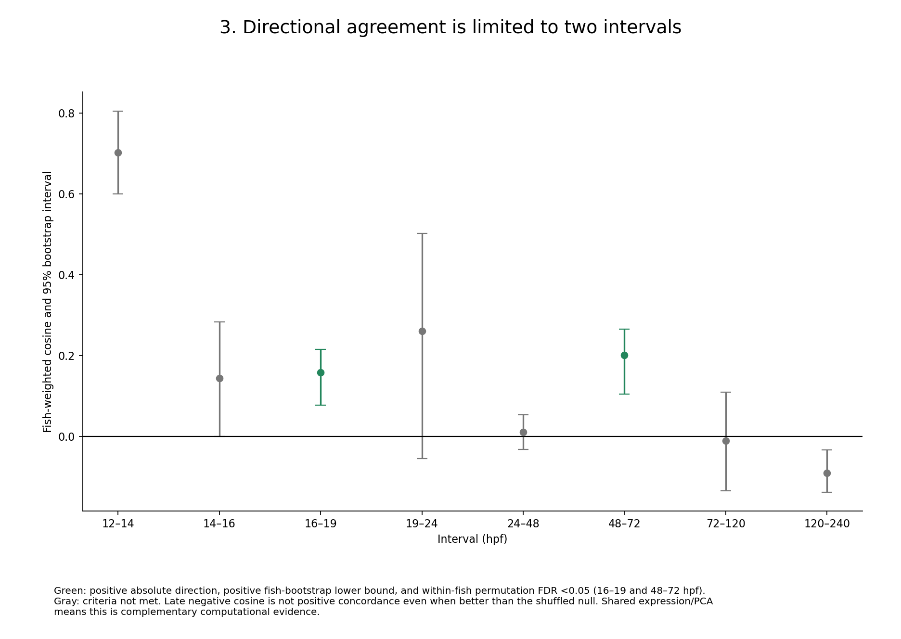
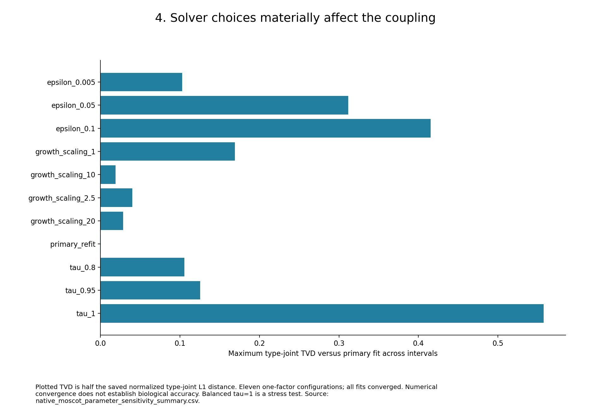
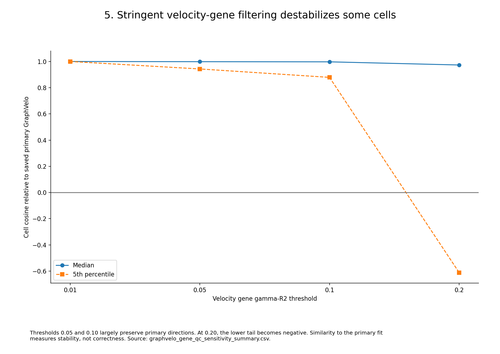

# Figure index: current results and project history

All figures are included regardless of whether they support the current model. Status labels identify exploratory and superseded work. [Executed notebooks](README.md#saved-notebook-history).

## 1. 1. Cohort and sampling support

5,426 cells; 36 different fish; four fish per stage. The 12 hpf stage has 19 cells and cannot support type-level 12–14 hpf claims. Fish at different stages are different animals.

## 2. 2. Growth priors change late transport most

Top: aggregate source-mass effect. Bottom: mean within-fish normalized effect with descriptive 95% fish-bootstrap intervals; these are different estimands. No bootstrap refitting. The 0.05 line is an operational reporting rule, not biological significance.

## 3. 3. Directional agreement is limited to two intervals

Green: positive absolute direction, positive fish-bootstrap lower bound, and within-fish permutation FDR <0.05 (16–19 and 48–72 hpf). Gray: criteria not met. Late negative cosine is not positive concordance even when better than the shuffled null. Shared expression/PCA means this is complementary computational evidence.

## 4. 4. Solver choices materially affect the coupling

Plotted TVD is half the saved normalized type-joint L1 distance. Eleven one-factor configurations; all fits converged. Numerical convergence does not establish biological accuracy. Balanced tau=1 is a stress test. Source: native_moscot_parameter_sensitivity_summary.csv.

## 5. 5. Stringent velocity-gene filtering destabilizes some cells

Thresholds 0.05 and 0.10 largely preserve primary directions. At 0.20, the lower tail becomes negative. Similarity to the primary fit measures stability, not correctness. Source: graphvelo_gene_qc_sensitivity_summary.csv.

## 6. 6. What succeeded, what did not, and what is still unknown

Historical plots are a record of work, not additional validation of the current model. The separate non-OT project and unapproved integrated proposal are outside this project record.

## Complete displayed figure index

| Page | Figure | Status | Original |
|---:|---|---|---|
| 1 | [1. Cohort and sampling support](overview/01_cohort_support.png) | CURRENT SUMMARY / SAVED TABLES | [File](overview/01_cohort_support.png) |
| 2 | [2. Growth priors change late transport most](overview/02_growth_effect.png) | CURRENT SUMMARY / SAVED TABLES | [File](overview/02_growth_effect.png) |
| 3 | [3. Directional agreement is limited to two intervals](overview/03_directional_agreement.png) | CURRENT SUMMARY / SAVED TABLES | [File](overview/03_directional_agreement.png) |
| 4 | [4. Solver choices materially affect the coupling](overview/04_parameter_sensitivity.png) | CURRENT SUMMARY / SAVED TABLES | [File](overview/04_parameter_sensitivity.png) |
| 5 | [5. Stringent velocity-gene filtering destabilizes some cells](overview/05_velocity_qc.png) | CURRENT SUMMARY / SAVED TABLES | [File](overview/05_velocity_qc.png) |
| 6 | [6. What succeeded, what did not, and what is still unknown](overview/06_interpretation.png) | CURRENT SUMMARY / SAVED TABLES | [File](overview/06_interpretation.png) |
| 7 | [cell 017 output 02](notebook_figures/zebrafish_hematopoiesis_growth_mapping_graphvelo_moscot/cell_017_output_02.png) | CURRENT SAVED RUN | [File](notebook_figures/zebrafish_hematopoiesis_growth_mapping_graphvelo_moscot/cell_017_output_02.png) |
| 8 | [cell 023 output 01](notebook_figures/zebrafish_hematopoiesis_growth_mapping_graphvelo_moscot/cell_023_output_01.png) | CURRENT SAVED RUN | [File](notebook_figures/zebrafish_hematopoiesis_growth_mapping_graphvelo_moscot/cell_023_output_01.png) |
| 9 | [cell 066 output 02](notebook_figures/zebrafish_hematopoiesis_growth_mapping_graphvelo_moscot/cell_066_output_02.png) | CURRENT SAVED RUN | [File](notebook_figures/zebrafish_hematopoiesis_growth_mapping_graphvelo_moscot/cell_066_output_02.png) |
| 10 | [cell 066 output 03](notebook_figures/zebrafish_hematopoiesis_growth_mapping_graphvelo_moscot/cell_066_output_03.png) | CURRENT SAVED RUN | [File](notebook_figures/zebrafish_hematopoiesis_growth_mapping_graphvelo_moscot/cell_066_output_03.png) |
| 11 | [cell 056 output 02](notebook_figures/hematopoiesis_GraphVelo_moscot/cell_056_output_02.png) | HISTORICAL / SAVED ERROR | [File](notebook_figures/hematopoiesis_GraphVelo_moscot/cell_056_output_02.png) |
| 12 | [cell 058 output 02](notebook_figures/hematopoiesis_GraphVelo_moscot/cell_058_output_02.png) | HISTORICAL / SAVED ERROR | [File](notebook_figures/hematopoiesis_GraphVelo_moscot/cell_058_output_02.png) |
| 13 | [cell 060 output 03](notebook_figures/hematopoiesis_GraphVelo_moscot/cell_060_output_03.png) | HISTORICAL / SAVED ERROR | [File](notebook_figures/hematopoiesis_GraphVelo_moscot/cell_060_output_03.png) |
| 14 | [cell 072 output 02](notebook_figures/hematopoiesis_GraphVelo_moscot/cell_072_output_02.png) | HISTORICAL / SAVED ERROR | [File](notebook_figures/hematopoiesis_GraphVelo_moscot/cell_072_output_02.png) |
| 15 | [cell 016 output 02](notebook_figures/hematopoiesis_graphvelo_2/cell_016_output_02.png) | HISTORICAL / PARTIAL RUN | [File](notebook_figures/hematopoiesis_graphvelo_2/cell_016_output_02.png) |
| 16 | [cell 040 output 01](notebook_figures/hematopoiesis_graphvelo_2/cell_040_output_01.png) | HISTORICAL / PARTIAL RUN | [File](notebook_figures/hematopoiesis_graphvelo_2/cell_040_output_01.png) |
| 17 | [cell 047 output 01](notebook_figures/hematopoiesis_graphvelo_2/cell_047_output_01.png) | HISTORICAL / PARTIAL RUN | [File](notebook_figures/hematopoiesis_graphvelo_2/cell_047_output_01.png) |
| 18 | [cell 026 output 01](notebook_figures/zebrafish_human_cross_species_validation.before_expanded_panel/cell_026_output_01.png) | SUPERSEDED HUMAN VALIDATION | [File](notebook_figures/zebrafish_human_cross_species_validation.before_expanded_panel/cell_026_output_01.png) |
| 19 | [cell 027 output 01](notebook_figures/zebrafish_human_cross_species_validation.before_expanded_panel/cell_027_output_01.png) | SUPERSEDED HUMAN VALIDATION | [File](notebook_figures/zebrafish_human_cross_species_validation.before_expanded_panel/cell_027_output_01.png) |
| 20 | [cell 027 output 02](notebook_figures/zebrafish_human_cross_species_validation.before_expanded_panel/cell_027_output_02.png) | SUPERSEDED HUMAN VALIDATION | [File](notebook_figures/zebrafish_human_cross_species_validation.before_expanded_panel/cell_027_output_02.png) |
| 21 | [cell 028 output 01](notebook_figures/zebrafish_human_cross_species_validation.before_expanded_panel/cell_028_output_01.png) | SUPERSEDED HUMAN VALIDATION | [File](notebook_figures/zebrafish_human_cross_species_validation.before_expanded_panel/cell_028_output_01.png) |
| 22 | [cell 029 output 01](notebook_figures/zebrafish_human_cross_species_validation.before_expanded_panel/cell_029_output_01.png) | SUPERSEDED HUMAN VALIDATION | [File](notebook_figures/zebrafish_human_cross_species_validation.before_expanded_panel/cell_029_output_01.png) |
| 23 | [cell 030 output 01](notebook_figures/zebrafish_human_cross_species_validation.before_expanded_panel/cell_030_output_01.png) | SUPERSEDED HUMAN VALIDATION | [File](notebook_figures/zebrafish_human_cross_species_validation.before_expanded_panel/cell_030_output_01.png) |
| 24 | [exploratory cell level candidate markers / page 1](previews/figure_025-001.png) | CURRENT / READ WITH CORRECTED AUDITS | [File](original_figures/blood_growth_graphvelo_moscot_v2/results/figures/exploratory_cell_level_candidate_markers.pdf) |
| 25 | [moscot M1 conditional fate heatmaps / page 1](previews/figure_026-001.png) | CURRENT / READ WITH CORRECTED AUDITS | [File](original_figures/blood_growth_graphvelo_moscot_v2/results/figures/moscot_M1_conditional_fate_heatmaps.pdf) |
| 26 | [official fine type pca state space / page 1](previews/figure_027-001.png) | CURRENT / READ WITH CORRECTED AUDITS | [File](original_figures/blood_growth_graphvelo_moscot_v2/results/figures/official_fine_type_pca_state_space.pdf) |
| 27 | [velocity agreement by proliferation quartile / page 1](previews/figure_028-001.png) | CURRENT / READ WITH CORRECTED AUDITS | [File](original_figures/blood_growth_graphvelo_moscot_v2/results/figures/velocity_agreement_by_proliferation_quartile.pdf) |
| 28 | [01 dataset audit / page 1](previews/figure_029-001.png) | CURRENT EXPRESSION-PROGRAM VALIDATION | [File](original_figures/cross_species_validation/figures/01_dataset_audit.pdf) |
| 29 | [02 apoptosis pseudobulks / page 1](previews/figure_030-001.png) | CURRENT EXPRESSION-PROGRAM VALIDATION | [File](original_figures/cross_species_validation/figures/02_apoptosis_pseudobulks.pdf) |
| 30 | [02 proliferation pseudobulks / page 1](previews/figure_031-001.png) | CURRENT EXPRESSION-PROGRAM VALIDATION | [File](original_figures/cross_species_validation/figures/02_proliferation_pseudobulks.pdf) |
| 31 | [03 zebrafish popescu proliferation profile / page 1](previews/figure_032-001.png) | CURRENT EXPRESSION-PROGRAM VALIDATION | [File](original_figures/cross_species_validation/figures/03_zebrafish_popescu_proliferation_profile.pdf) |
| 32 | [04 replicate proliferation time / page 1](previews/figure_033-001.png) | CURRENT EXPRESSION-PROGRAM VALIDATION | [File](original_figures/cross_species_validation/figures/04_replicate_proliferation_time.pdf) |
| 33 | [05 popescu gse hspc gene slopes / page 1](previews/figure_034-001.png) | CURRENT EXPRESSION-PROGRAM VALIDATION | [File](original_figures/cross_species_validation/figures/05_popescu_gse_hspc_gene_slopes.pdf) |
| 34 | [data driven candidate markers / page 1](previews/figure_035-001.png) | HISTORICAL / SUPERSEDED | [File](original_figures/blood_graphvelo_official/results/figures/data_driven_candidate_markers.pdf) |
| 35 | [hspc combined pushforward fates / page 1](previews/figure_036-001.png) | HISTORICAL / SUPERSEDED | [File](original_figures/blood_graphvelo_official/results/figures/hspc_combined_pushforward_fates.pdf) |
| 36 | [moscot graphvelo real time velocity quiver / page 1](previews/figure_037-001.png) | HISTORICAL / SUPERSEDED | [File](original_figures/blood_graphvelo_official/results/figures/moscot_graphvelo_real_time_velocity_quiver.pdf) |
| 37 | [moscot graphvelo type transition heatmaps / page 1](previews/figure_038-001.png) | HISTORICAL / SUPERSEDED | [File](original_figures/blood_graphvelo_official/results/figures/moscot_graphvelo_type_transition_heatmaps.pdf) |
| 38 | [moscot vs combined directional diagnostics / page 1](previews/figure_039-001.png) | HISTORICAL / SUPERSEDED | [File](original_figures/blood_graphvelo_official/results/figures/moscot_vs_combined_directional_diagnostics.pdf) |
| 39 | [moscot vs combined directional diagnostics](original_figures/blood_graphvelo_official/results/figures/moscot_vs_combined_directional_diagnostics.png) | HISTORICAL / SUPERSEDED | [File](original_figures/blood_graphvelo_official/results/figures/moscot_vs_combined_directional_diagnostics.png) |
| 40 | [official fine type lineage network / page 1](previews/figure_041-001.png) | HISTORICAL / SUPERSEDED | [File](original_figures/blood_graphvelo_official/results/figures/official_fine_type_lineage_network.pdf) |
| 41 | [official fine type marker validation / page 1](previews/figure_042-001.png) | HISTORICAL / SUPERSEDED | [File](original_figures/blood_graphvelo_official/results/figures/official_fine_type_marker_validation.pdf) |
| 42 | [official fine type pca state space / page 1](previews/figure_043-001.png) | HISTORICAL / SUPERSEDED | [File](original_figures/blood_graphvelo_official/results/figures/official_fine_type_pca_state_space.pdf) |
| 43 | [official label ode trajectories / page 1](previews/figure_044-001.png) | HISTORICAL / SUPERSEDED | [File](original_figures/blood_graphvelo_official/results/figures/official_label_ode_trajectories.pdf) |
| 44 | [M2 conditional fate heatmaps / page 1](previews/figure_045-001.png) | ARCHIVED / SUPERSEDED | [File](original_figures/archive/2026-09-01_legacy_mapping_and_M2/figures/M2_conditional_fate_heatmaps.pdf) |
| 45 | [01 dataset audit / page 1](previews/figure_046-001.png) | ARCHIVED / SUPERSEDED | [File](original_figures/archive/2026-09-10_cross_species_legacy_38_12/figures/01_dataset_audit.pdf) |
| 46 | [02 apoptosis pseudobulks / page 1](previews/figure_047-001.png) | ARCHIVED / SUPERSEDED | [File](original_figures/archive/2026-09-10_cross_species_legacy_38_12/figures/02_apoptosis_pseudobulks.pdf) |
| 47 | [02 proliferation pseudobulks / page 1](previews/figure_048-001.png) | ARCHIVED / SUPERSEDED | [File](original_figures/archive/2026-09-10_cross_species_legacy_38_12/figures/02_proliferation_pseudobulks.pdf) |
| 48 | [03 zebrafish popescu proliferation profile / page 1](previews/figure_049-001.png) | ARCHIVED / SUPERSEDED | [File](original_figures/archive/2026-09-10_cross_species_legacy_38_12/figures/03_zebrafish_popescu_proliferation_profile.pdf) |
| 49 | [04 replicate proliferation time / page 1](previews/figure_050-001.png) | ARCHIVED / SUPERSEDED | [File](original_figures/archive/2026-09-10_cross_species_legacy_38_12/figures/04_replicate_proliferation_time.pdf) |
| 50 | [05 popescu gse hspc gene slopes / page 1](previews/figure_051-001.png) | ARCHIVED / SUPERSEDED | [File](original_figures/archive/2026-09-10_cross_species_legacy_38_12/figures/05_popescu_gse_hspc_gene_slopes.pdf) |
| 51 | [data driven candidate markers / page 1](previews/figure_052-001.png) | ARCHIVED / SUPERSEDED | [File](original_figures/archive/2026-09-15_replaced_cell_level_marker_output/data_driven_candidate_markers.pdf) |
| 52 | [actc1b pilot trajectory](original_figures/cluster23_pilot_trajectories/actc1b_pilot_trajectory.png) | EXPLORATORY CLUSTER-23 PILOT | [File](original_figures/cluster23_pilot_trajectories/actc1b_pilot_trajectory.png) |
| 53 | [actc1b time expression manifold](original_figures/cluster23_pilot_trajectories/actc1b_time_expression_manifold.png) | EXPLORATORY CLUSTER-23 PILOT | [File](original_figures/cluster23_pilot_trajectories/actc1b_time_expression_manifold.png) |
| 54 | [alas2 time expression manifold](original_figures/cluster23_pilot_trajectories/alas2_time_expression_manifold.png) | EXPLORATORY CLUSTER-23 PILOT | [File](original_figures/cluster23_pilot_trajectories/alas2_time_expression_manifold.png) |
| 55 | [cluster23 multigene pilot trajectory](original_figures/cluster23_pilot_trajectories/cluster23_multigene_pilot_trajectory.png) | EXPLORATORY CLUSTER-23 PILOT | [File](original_figures/cluster23_pilot_trajectories/cluster23_multigene_pilot_trajectory.png) |
| 56 | [gata2a pilot trajectory](original_figures/cluster23_pilot_trajectories/gata2a_pilot_trajectory.png) | EXPLORATORY CLUSTER-23 PILOT | [File](original_figures/cluster23_pilot_trajectories/gata2a_pilot_trajectory.png) |
| 57 | [gata2a time expression manifold](original_figures/cluster23_pilot_trajectories/gata2a_time_expression_manifold.png) | EXPLORATORY CLUSTER-23 PILOT | [File](original_figures/cluster23_pilot_trajectories/gata2a_time_expression_manifold.png) |
| 58 | [hbae3 pilot trajectory](original_figures/cluster23_pilot_trajectories/hbae3_pilot_trajectory.png) | EXPLORATORY CLUSTER-23 PILOT | [File](original_figures/cluster23_pilot_trajectories/hbae3_pilot_trajectory.png) |
| 59 | [hbae3 time expression manifold](original_figures/cluster23_pilot_trajectories/hbae3_time_expression_manifold.png) | EXPLORATORY CLUSTER-23 PILOT | [File](original_figures/cluster23_pilot_trajectories/hbae3_time_expression_manifold.png) |
| 60 | [hbbe3 pilot trajectory](original_figures/cluster23_pilot_trajectories/hbbe3_pilot_trajectory.png) | EXPLORATORY CLUSTER-23 PILOT | [File](original_figures/cluster23_pilot_trajectories/hbbe3_pilot_trajectory.png) |
| 61 | [hbbe3 time expression manifold](original_figures/cluster23_pilot_trajectories/hbbe3_time_expression_manifold.png) | EXPLORATORY CLUSTER-23 PILOT | [File](original_figures/cluster23_pilot_trajectories/hbbe3_time_expression_manifold.png) |
| 62 | [krt4 pilot trajectory](original_figures/cluster23_pilot_trajectories/krt4_pilot_trajectory.png) | EXPLORATORY CLUSTER-23 PILOT | [File](original_figures/cluster23_pilot_trajectories/krt4_pilot_trajectory.png) |
| 63 | [krt91 pilot trajectory](original_figures/cluster23_pilot_trajectories/krt91_pilot_trajectory.png) | EXPLORATORY CLUSTER-23 PILOT | [File](original_figures/cluster23_pilot_trajectories/krt91_pilot_trajectory.png) |
| 64 | [lmo2 pilot trajectory](original_figures/cluster23_pilot_trajectories/lmo2_pilot_trajectory.png) | EXPLORATORY CLUSTER-23 PILOT | [File](original_figures/cluster23_pilot_trajectories/lmo2_pilot_trajectory.png) |
| 65 | [mylpfa pilot trajectory](original_figures/cluster23_pilot_trajectories/mylpfa_pilot_trajectory.png) | EXPLORATORY CLUSTER-23 PILOT | [File](original_figures/cluster23_pilot_trajectories/mylpfa_pilot_trajectory.png) |
| 66 | [mylpfb pilot trajectory](original_figures/cluster23_pilot_trajectories/mylpfb_pilot_trajectory.png) | EXPLORATORY CLUSTER-23 PILOT | [File](original_figures/cluster23_pilot_trajectories/mylpfb_pilot_trajectory.png) |
| 67 | [pvalb1 pilot trajectory](original_figures/cluster23_pilot_trajectories/pvalb1_pilot_trajectory.png) | EXPLORATORY CLUSTER-23 PILOT | [File](original_figures/cluster23_pilot_trajectories/pvalb1_pilot_trajectory.png) |
| 68 | [pvalb2 pilot trajectory](original_figures/cluster23_pilot_trajectories/pvalb2_pilot_trajectory.png) | EXPLORATORY CLUSTER-23 PILOT | [File](original_figures/cluster23_pilot_trajectories/pvalb2_pilot_trajectory.png) |
| 69 | [spi1b pilot trajectory](original_figures/cluster23_pilot_trajectories/spi1b_pilot_trajectory.png) | EXPLORATORY CLUSTER-23 PILOT | [File](original_figures/cluster23_pilot_trajectories/spi1b_pilot_trajectory.png) |
| 70 | [spi1b time expression manifold](original_figures/cluster23_pilot_trajectories/spi1b_time_expression_manifold.png) | EXPLORATORY CLUSTER-23 PILOT | [File](original_figures/cluster23_pilot_trajectories/spi1b_time_expression_manifold.png) |
| 71 | [sptb pilot trajectory](original_figures/cluster23_pilot_trajectories/sptb_pilot_trajectory.png) | EXPLORATORY CLUSTER-23 PILOT | [File](original_figures/cluster23_pilot_trajectories/sptb_pilot_trajectory.png) |
| 72 | [tal1 pilot trajectory](original_figures/cluster23_pilot_trajectories/tal1_pilot_trajectory.png) | EXPLORATORY CLUSTER-23 PILOT | [File](original_figures/cluster23_pilot_trajectories/tal1_pilot_trajectory.png) |
| 73 | [tal1 time expression manifold](original_figures/cluster23_pilot_trajectories/tal1_time_expression_manifold.png) | EXPLORATORY CLUSTER-23 PILOT | [File](original_figures/cluster23_pilot_trajectories/tal1_time_expression_manifold.png) |
| 74 | [tnni2a.4 pilot trajectory](original_figures/cluster23_pilot_trajectories/tnni2a.4_pilot_trajectory.png) | EXPLORATORY CLUSTER-23 PILOT | [File](original_figures/cluster23_pilot_trajectories/tnni2a.4_pilot_trajectory.png) |
| 75 | [tnnt3b pilot trajectory](original_figures/cluster23_pilot_trajectories/tnnt3b_pilot_trajectory.png) | EXPLORATORY CLUSTER-23 PILOT | [File](original_figures/cluster23_pilot_trajectories/tnnt3b_pilot_trajectory.png) |
| 76 | [fig1 gv stream](original_figures/figs_graphvelo/fig1_gv_stream.png) | EXPLORATORY WHOLE-ATLAS GRAPHVELO | [File](original_figures/figs_graphvelo/fig1_gv_stream.png) |
| 77 | [fig2 ddhodge potential](original_figures/figs_graphvelo/fig2_ddhodge_potential.png) | EXPLORATORY WHOLE-ATLAS GRAPHVELO | [File](original_figures/figs_graphvelo/fig2_ddhodge_potential.png) |
| 78 | [fig3 boxplot](original_figures/figs_graphvelo/fig3_boxplot.png) | EXPLORATORY WHOLE-ATLAS GRAPHVELO | [File](original_figures/figs_graphvelo/fig3_boxplot.png) |
| 79 | [fig4 hpf umap](original_figures/figs_graphvelo/fig4_hpf_umap.png) | EXPLORATORY WHOLE-ATLAS GRAPHVELO | [File](original_figures/figs_graphvelo/fig4_hpf_umap.png) |
| 80 | [fig5 per cluster rho](original_figures/figs_graphvelo/fig5_per_cluster_rho.png) | EXPLORATORY WHOLE-ATLAS GRAPHVELO | [File](original_figures/figs_graphvelo/fig5_per_cluster_rho.png) |
